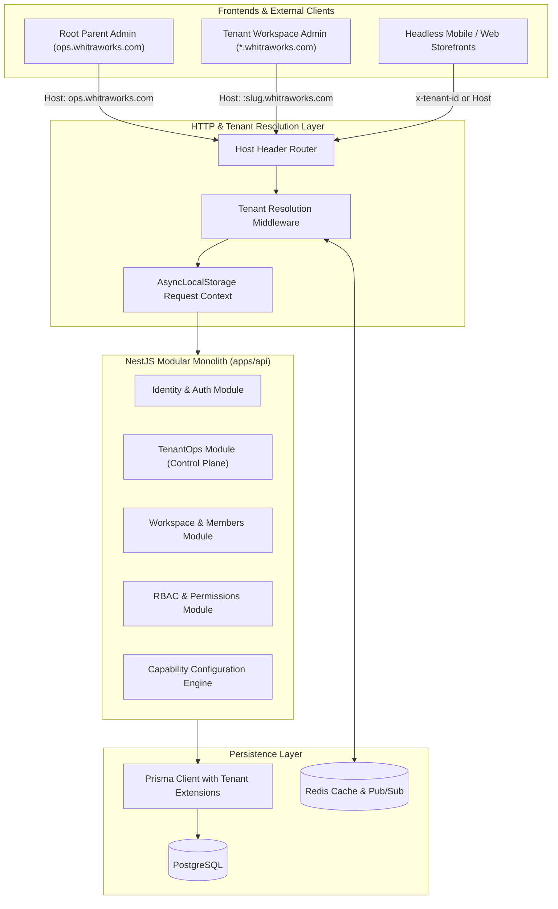
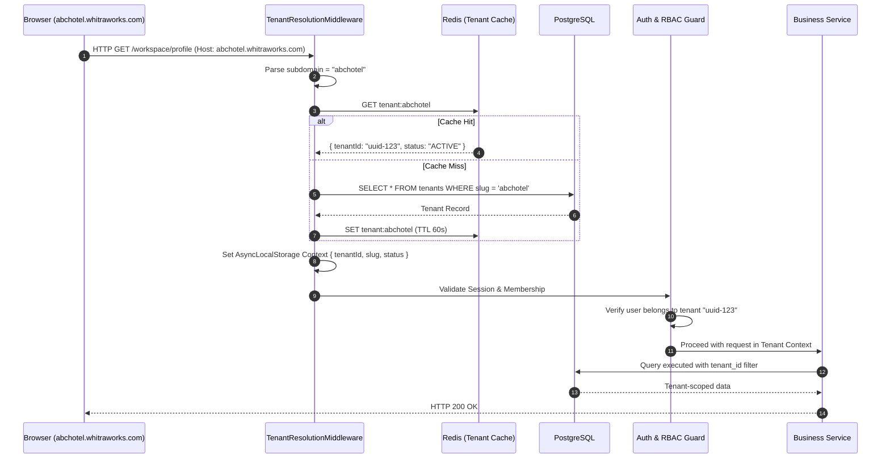

# WhitraWorks Core Platform — Architecture & Operating Model

**Status:** APPROVED / SPECIFICATION COMPLETE  
**Architecture Style:** Monorepo + Modular Monolith + Subdomain Multi-Tenancy  
**Primary Tech Stack:** NestJS + React 19 / Vite + PostgreSQL / Prisma  

---

## 1. High-Level Architecture Overview

WhitraWorks is architected as a **modular monolith** within a high-performance **monorepo**. The system cleanly separates the **Control Plane** (Root Parent Admin) from the **Data Plane** (Tenant Workspaces).



---

## 2. Monorepo Structure (`pnpm` + `Turborepo`)

The monorepo organizes applications, shared libraries, and tooling with strict dependency enforcement.

```text
whitraworks/
├── apps/
│   ├── api/                    # NestJS Modular Monolith API
│   │   ├── src/
│   │   │   ├── core/           # Tenant resolution, context, database module
│   │   │   ├── modules/
│   │   │   │   ├── auth/       # Global authentication, password hashing, cookies
│   │   │   │   ├── ops/        # Root superadmin endpoints (tenants, capabilities)
│   │   │   │   ├── workspace/  # Tenant profiles, members, invitations
│   │   │   │   ├── rbac/       # Roles, permissions, access guards
│   │   │   │   └── audit/      # Immutable audit logging
│   │   │   └── main.ts
│   │   └── package.json
│   │
│   ├── ops-admin/              # React 19 + Vite (Root Parent Admin / Control Plane)
│   │   ├── src/                # ops.whitraworks.com
│   │   └── package.json
│   │
│   └── tenant-admin/           # React 19 + Vite (Tenant Workspace Admin / Data Plane)
│       ├── src/                # *.whitraworks.com
│       └── package.json
│
├── packages/
│   ├── database/               # Prisma schema, migrations, seeders, client extensions
│   ├── types/                  # Shared TypeScript interfaces, DTOs, and contracts
│   ├── config/                 # Shared Tailwind, ESLint, TypeScript configurations
│   └── ui/                     # Shared UI component library (shadcn/Radix-based)
│
├── docs/                       # Architecture, PRD, APIs, Data Model specs
├── docker-compose.yml          # Local PostgreSQL 16 & Redis 7 services
├── package.json                # Root package.json with pnpm workspaces
├── pnpm-workspace.yaml
├── turbo.json                  # Turborepo pipeline caching
└── tsconfig.base.json          # Strict base TypeScript config
```

### Dependency Rules (Enforced via Linting)
1. **`packages/types`**: Foundation tier. Imports nothing. Imported by all.
2. **`packages/database`**: Data layer. Imports `types`. Imported by `apps/api`.
3. **`packages/ui`**: Component layer. Imported by frontends (`ops-admin`, `tenant-admin`). Never imports backend packages.
4. **`apps/*`**: Consumer tier. Frontends **never** import backend code or Prisma clients.

---

## 3. Subdomain Resolution & Request Lifecycle

### 3.1 Subdomain Mapping
* **Local Development**:
  * Root Ops: `ops.localhost:3001`
  * Tenant Workspaces: `<slug>.localhost:3000` (e.g., `abchotel.localhost:3000`)
  * API: `api.localhost:4000`
  * *Note: Modern web browsers automatically route any `*.localhost` domain to `127.0.0.1` without needing `/etc/hosts` modifications.*
* **Production**:
  * Root Ops: `ops.whitraworks.com`
  * Tenant Workspaces: `<slug>.whitraworks.com`
  * API: `api.whitraworks.com`

### 3.2 Request Flow Diagram


---

## 4. Control Plane vs. Data Plane Separation

To prevent architectural blurring and cross-tenant security vulnerabilities, WhitraWorks implements strict two-tier separation:

```text
┌────────────────────────────────────────────────────────────────────────┐
│                   CONTROL PLANE (apps/ops-admin)                       │
│                     Host: ops.whitraworks.com                          │
├────────────────────────────────────────────────────────────────────────┤
│  • Platform Superadmin Authentication & Session Gate                   │
│  • Tenant Directory & Provisioning Engine                              │
│  • Tenant Status Toggles (Active / Suspended / Terminated)             │
│  • Capability Registry Configuration per Tenant                        │
│  • Global Platform Telemetry & Cross-Tenant Audit Logs                 │
│  • Read-only Tenant Impersonation for Support Engineering              │
└───────────────────────────────────┬────────────────────────────────────┘
                                    │
                                    │ Governs & Configures
                                    ▼
┌────────────────────────────────────────────────────────────────────────┐
│                   DATA PLANE (apps/tenant-admin)                       │
│                     Host: <slug>.whitraworks.com                       │
├────────────────────────────────────────────────────────────────────────┤
│  • Tenant Workspace Authentication & Host-Scoped Session               │
│  • Workspace Profile & Operational Parameters (Timezone, Currency)     │
│  • Staff Invitation & Membership Lifecycle (Owner, Admin, Staff)       │
│  • Custom Role & Granular Permission Management                        │
│  • Dynamic UI rendering reflecting only enabled capabilities           │
│  • Tenant-scoped Audit Trail                                           │
└────────────────────────────────────────────────────────────────────────┘
```

---

## 5. Authentication & Session Management

### 5.1 Password Hashing
* Uses **Argon2id** (memory-hard, resistant to GPU/ASIC brute-force attacks) with salt generation per credential.

### 5.2 Cookie Architecture (Host-Scoped, No Cross-Subdomain Leaks)
* Reference learning from our Better Auth architecture: We **do not** use wildcard cookies (`domain: .whitraworks.com`).
* Each session cookie is locked to the specific hostname:
  * `ops.whitraworks.com` receives an Ops Session Cookie: `__whitraworks_ops_session`.
  * `abchotel.whitraworks.com` receives a Tenant Session Cookie: `__whitraworks_tenant_session`.
* Cookie Security Attributes:
  * `HttpOnly: true` (prevents JavaScript/XSS extraction)
  * `Secure: true` (transmitted only over HTTPS)
  * `SameSite: Lax` (protects against CSRF)
  * `Path: /`

### 5.3 Rolling Expiration Model
* **Absolute Expiry**: 30 days.
* **Rolling Refresh**: If a request arrives and the session was issued more than 24 hours ago, the backend automatically issues a refreshed cookie with an extended 30-day expiry. Active users stay signed in seamlessly.

---

## 6. Authorization Model (Deny-by-Default RBAC)

1. **Permission Resolution**:
   * Permissions are never embedded inside JWTs or cookies (which would become stale when an admin modifies a role).
   * Permissions are resolved dynamically from the database and cached in-process for 5 minutes (`scope_cache`).
2. **Two Orthogonal Tiers**:
   * Platform Scopes: `platform:superadmin`, `platform:support`.
   * Tenant Scopes: `workspace:manage`, `members:invite`, `roles:manage`, `audit:read`.
   * **Invariant**: A tenant `Owner` has full administrative power *within their workspace*, but has zero platform privileges. No tenant role can satisfy a `platform:*` requirement.

---

## 7. Technology Stack Choices & Rationale

| Layer | Selected Tech | Rationale |
|---|---|---|
| **Monorepo Tool** | `pnpm` + `Turborepo` | Fastest package manager with symlink caching; Turborepo provides zero-config computation caching for builds and tests. |
| **Backend API** | NestJS (TypeScript) | Enterprise-grade architecture with native dependency injection, decorators, guards, interceptors, and modular structure. |
| **Database & ORM** | PostgreSQL 16 + Prisma ORM | Relational integrity, ACID compliance for business operations, type-safe queries, migration tracking, and Prisma Client Extensions for automated tenant isolation. |
| **Frontends** | React 19 + Vite | Maximum speed, lightweight bundles, SPA performance, and independent build pipelines for `ops-admin` and `tenant-admin`. |
| **Styling** | Tailwind CSS + Radix UI | Fast, accessible, customizable UI design system without bloated external component library dependencies. |
| **In-Memory Cache** | Redis 7 | Sub-millisecond tenant resolution cache, session store, and cross-pod pub/sub invalidation. |
