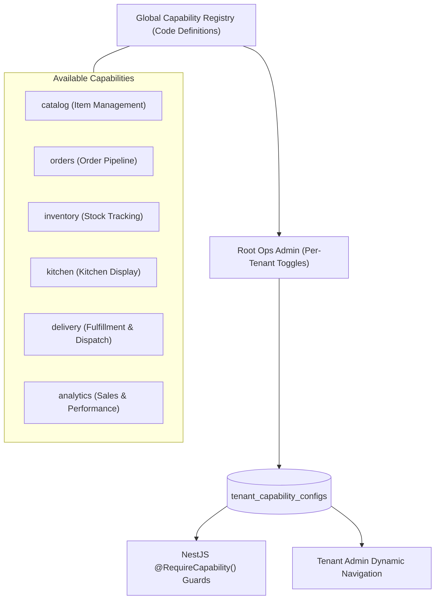

# WhitraWorks Core Platform — Capability Configuration Engine

**Status:** APPROVED / SPECIFICATION COMPLETE  
**Pattern:** Pluggable Feature Capabilities (Composition over Inheritance)  

---

## 1. Architectural Philosophy

A traditional multi-business application falls into the **conditional branching trap**:

```typescript
// ❌ ANTI-PATTERN: Hard-coded business type conditionals
if (tenant.businessType === 'restaurant') {
  showKitchenTab();
} else if (tenant.businessType === 'clothing') {
  showSizeColorVariants();
} else if (tenant.businessType === 'grocery') {
  showExpirationDates();
}
```

This creates brittle, tangled spaghetti code. 

In WhitraWorks, the core platform remains **business-agnostic**. The platform thinks purely in terms of **Capabilities**:



---

## 2. Global Capability Registry

The Capability Registry is defined in code (`packages/types/src/capabilities.ts`) as the single source of truth:

```typescript
export interface CapabilityDefinition {
  code: string;
  name: string;
  description: string;
  category: 'core' | 'operations' | 'fulfillment' | 'intelligence';
  dependencies: string[]; // Codes of capabilities that must be enabled first
  defaultEnabled: boolean;
}

export const CAPABILITY_REGISTRY: Record<string, CapabilityDefinition> = {
  catalog: {
    code: 'catalog',
    name: 'Product & Menu Catalog',
    description: 'Manage categories, items, pricing, and variants/options.',
    category: 'core',
    dependencies: [],
    defaultEnabled: true,
  },
  orders: {
    code: 'orders',
    name: 'Order Lifecycle & Checkout',
    description: 'Cart, checkout, order creation, and payment verification.',
    category: 'core',
    dependencies: ['catalog'],
    defaultEnabled: true,
  },
  inventory: {
    code: 'inventory',
    name: 'Stock & Inventory Management',
    description: 'Real-time stock counts, re-order thresholds, and depletion tracking.',
    category: 'operations',
    dependencies: ['catalog'],
    defaultEnabled: false,
  },
  kitchen: {
    code: 'kitchen',
    name: 'Kitchen Display System (KDS)',
    description: 'Order preparation statuses, station assignments, and ticket ready alerts.',
    category: 'operations',
    dependencies: ['orders'],
    defaultEnabled: false,
  },
  delivery: {
    code: 'delivery',
    name: 'Delivery & Fulfillment Dispatch',
    description: 'Address verification, delivery zones, fees, and driver dispatch.',
    category: 'fulfillment',
    dependencies: ['orders'],
    defaultEnabled: false,
  },
  analytics: {
    code: 'analytics',
    name: 'Business Analytics & Reporting',
    description: 'Sales volume, revenue trends, and operational metrics.',
    category: 'intelligence',
    dependencies: ['orders'],
    defaultEnabled: false,
  },
};
```

---

## 3. Backend Enforcement (`@RequireCapability`)

NestJS endpoints guard business modules using a declarative `@RequireCapability()` decorator:

```typescript
// apps/api/src/modules/kitchen/kitchen.controller.ts
import { Controller, Get, UseGuards } from '@nestjs/common';
import { AuthGuard } from '../../core/guards/auth.guard';
import { CapabilityGuard } from '../../core/guards/capability.guard';
import { RequireCapability } from '../../core/decorators/capability.decorator';

@Controller('kitchen')
@UseGuards(AuthGuard, CapabilityGuard)
@RequireCapability('kitchen')
export class KitchenController {
  @Get('tickets')
  getActiveTickets() {
    // Only reachable if the active tenant has the 'kitchen' capability enabled
    return this.kitchenService.getActiveTickets();
  }
}
```

### The Guard Evaluation Logic
1. `CapabilityGuard` retrieves the active `tenantId` from request context.
2. It fetches the tenant's enabled capabilities (cached in Redis for fast evaluation).
3. If the required capability is disabled, the request immediately terminates with:
   ```json
   {
     "success": false,
     "error": {
       "code": "CAPABILITY_DISABLED",
       "message": "The capability 'kitchen' is not enabled for this workspace.",
       "details": { "requiredCapability": "kitchen" }
     }
   }
   ```

---

## 4. Frontend Dynamic Navigation (Tenant Admin)

In `apps/tenant-admin`, the sidebar navigation items are filtered against the workspace's enabled capabilities:

```tsx
// apps/tenant-admin/src/components/navigation/Sidebar.tsx
interface NavItem {
  label: string;
  href: string;
  icon: IconComponent;
  requiredCapability?: string; // Optional capability requirement
}

const NAVIGATION_ITEMS: NavItem[] = [
  { label: 'Overview', href: '/dashboard', icon: LayoutDashboardIcon },
  { label: 'Catalog', href: '/catalog', icon: BookOpenIcon, requiredCapability: 'catalog' },
  { label: 'Orders', href: '/orders', icon: ShoppingBagIcon, requiredCapability: 'orders' },
  { label: 'Kitchen Display', href: '/kitchen', icon: UtensilsIcon, requiredCapability: 'kitchen' },
  { label: 'Inventory', href: '/inventory', icon: PackageIcon, requiredCapability: 'inventory' },
  { label: 'Settings', href: '/settings', icon: SettingsIcon },
];

export function Sidebar() {
  const { enabledCapabilities } = useWorkspaceCapabilities();

  const visibleItems = NAVIGATION_ITEMS.filter(item => {
    if (!item.requiredCapability) return true;
    return enabledCapabilities.includes(item.requiredCapability);
  });

  return (
    <nav>
      {visibleItems.map(item => (
        <NavLink key={item.href} to={item.href} icon={item.icon}>
          {item.label}
        </NavLink>
      ))}
    </nav>
  );
}
```

---

## 5. Control Plane Configuration (`ops-admin`)

In `apps/ops-admin`, Root Superadmins see a **Capabilities Management Drawer** for each tenant:
* Interactive toggles for each capability from the registry.
* Dependency validation: Attempting to enable `kitchen` without `orders` automatically flags that `orders` must be enabled first.
* Toggling a capability writes to `tenant_capability_configs` and publishes a Redis invalidation event so API pods update their cache instantaneously.
