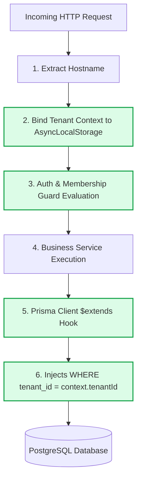

# WhitraWorks Core Platform — Security & Multi-Tenant Isolation

**Status:** APPROVED / SPECIFICATION COMPLETE  
**Compliance Target:** Enterprise SaaS Multi-Tenant Isolation  

---

## 1. Security Architecture Principles

WhitraWorks enforces four immutable security principles across all layers:

1. **Deny-by-Default Authorization**: No user, token, or request possesses any permission unless explicitly granted by a verified, non-expired role membership.
2. **Strict Host & Tenant Isolation**: Data from one tenant must never, under any circumstance, be accessible to another tenant. Isolation is enforced at the network, application, and database layers.
3. **Control Plane / Data Plane Invariance**: Platform operator privileges (`PLATFORM_ADMIN`) are completely orthogonal to tenant privileges (`TENANT_ADMIN`). A tenant admin has zero escalation path to platform capabilities.
4. **Defense in Depth**: Security controls are applied redundantly: at the Gateway, in the NestJS Guards, in AsyncLocalStorage context, and via Prisma Client query extensions.

---

## 2. Multi-Tenant Data Isolation Strategy



### Layer 1: Subdomain Validation
* The incoming `Host` header is parsed.
* The system checks the tenant against an in-memory/Redis cache.
* If the tenant is `SUSPENDED` or does not exist, the request terminates immediately with `403 Forbidden` / `404 Not Found` before hitting any business logic.

### Layer 2: AsyncLocalStorage Context
* Tenant context (`tenantId`, `slug`, `status`) is injected into Node.js `AsyncLocalStorage`.
* This context is thread-safe and isolated per async execution chain, ensuring no cross-request state contamination.

### Layer 3: Prisma Extension Hook (`$extends`)
* Even if a backend developer accidentally writes:
  ```typescript
  // Developer forgot tenantId!
  await prisma.role.findMany({ where: { isSystemRole: false } });
  ```
* The Prisma query extension intercepts the AST and rewrites the query to:
  ```sql
  SELECT * FROM roles 
  WHERE is_system_role = false 
    AND tenant_id = 'tenant_uuid_from_context';
  ```

---

## 3. Cookie Architecture & Session Protection

### 3.1 Host-Only Scoping (No Wildcard Cookies)
* **The Vulnerability**: Using a wildcard domain cookie (`domain: .whitraworks.com`) allows JavaScript or malicious redirects on `tenant-a.whitraworks.com` to send or manipulate cookies intended for `tenant-b.whitraworks.com` or `ops.whitraworks.com`.
* **The WhitraWorks Defense**: All session cookies omit the `Domain` attribute in the `Set-Cookie` header.
  * In RFC 6265, omitting `Domain` locks the cookie strictly to the **exact host** (Host-Only Cookie).
  * A cookie minted on `abchotel.whitraworks.com` will **never** be sent by the browser to `ops.whitraworks.com` or `greenmart.whitraworks.com`.

### 3.2 Cookie Flags
| Attribute | Value | Rationale |
|---|---|---|
| `HttpOnly` | `true` | Prevents theft via Cross-Site Scripting (XSS). |
| `Secure` | `true` | Sent exclusively over TLS/HTTPS connections. |
| `SameSite` | `Lax` | Protects against Cross-Site Request Forgery (CSRF). |
| `Path` | `/` | Accessible throughout the host application. |

---

## 4. Privilege Escalation Prevention

### 4.1 Root Superadmin Isolation
* Root Superadmin status is determined solely by `user.isPlatformSuperadmin == true` in the global `users` table.
* The Root Parent Admin (`ops-admin`) communicates exclusively with `/ops/*` endpoints.
* `/ops/*` endpoints are protected by `PlatformSuperadminGuard`, which checks:
  1. Valid session.
  2. `isPlatformSuperadmin === true`.
  3. `Host === 'ops.whitraworks.com'` (or `ops.localhost:3001`).
* Tenant users—even those with the `OWNER` role inside a workspace—cannot access `/ops/*` routes.

### 4.2 Workspace Permission Isolation
* When a user belongs to multiple workspaces (e.g. `OWNER` at ABC Hotel, `STAFF` at GreenMart), permissions are evaluated strictly against their `WorkspaceMember` record for the **active tenant** resolved from the `Host` header.
* A user's `OWNER` permissions at ABC Hotel provide zero elevated rights when they send requests to `greenmart.whitraworks.com`.

---

## 5. Password & Credential Security

* **Hashing Algorithm**: Argon2id.
* **Configuration Parameters**:
  * Memory Cost ($m$): $65,536\text{ KB}$ (64 MB)
  * Time Cost ($t$): 3 iterations
  * Parallelism ($p$): 4 threads
* **Salting**: 16-byte cryptographically secure random salt per user.
* **Timing-Safe Comparison**: Constant-time verification to prevent timing attacks.

---

## 6. Audit Logging & Security Observability

Every state-altering event in WhitraWorks produces an immutable audit record in `audit_logs`:
* **Events Logged**:
  * User Login (Success & Failure)
  * Workspace Public Registration
  * Member Invitations, Role Changes, Revocations
  * Capability Toggle by Root Ops
  * Tenant Status Changes (Activation, Suspension)
* **Audit Record Schema**:
  * `actorId`: User ID or system marker.
  * `tenantId`: Active tenant ID (or null for platform ops).
  * `action`: Namespaced action string (e.g., `member.invite`).
  * `diffJson`: Pre-change and post-change JSON delta.
  * `ipAddress` & `userAgent`: Client connection metadata.
